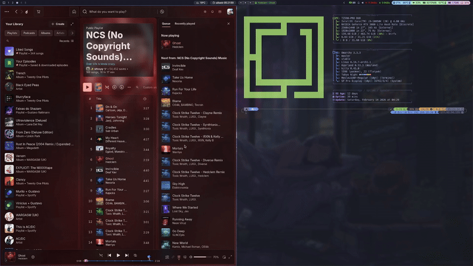

# My Omarchy Configuration
Feel free to use and edit the files. I reused most of the files from other repositories.

All scripts inside .config/waybar/scripts need of permission:
```bash
sudo chmod +x .config/waybar/scripts/*.sh
```

